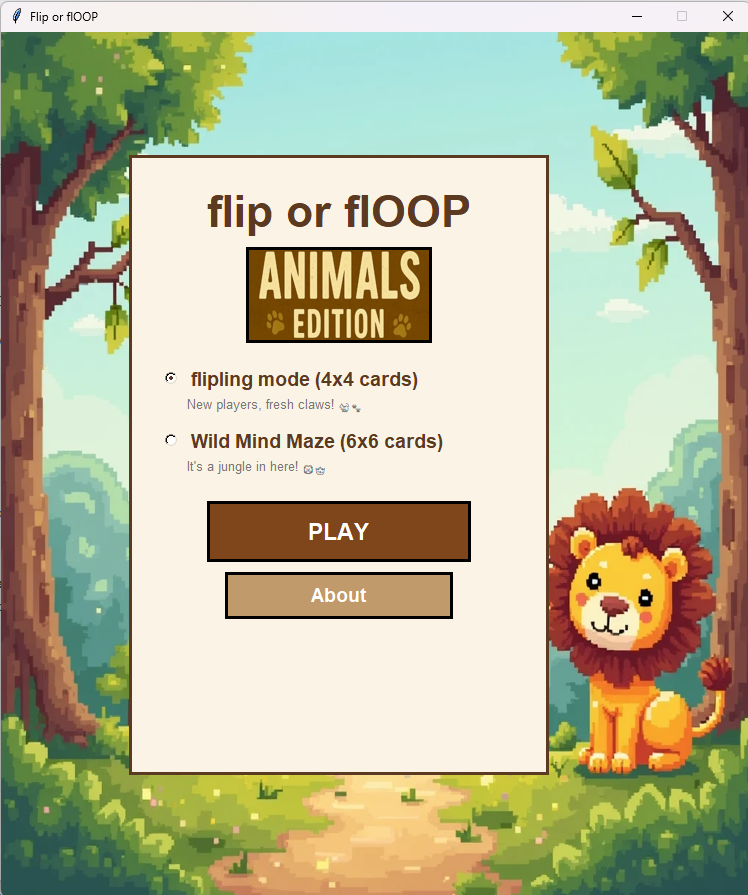
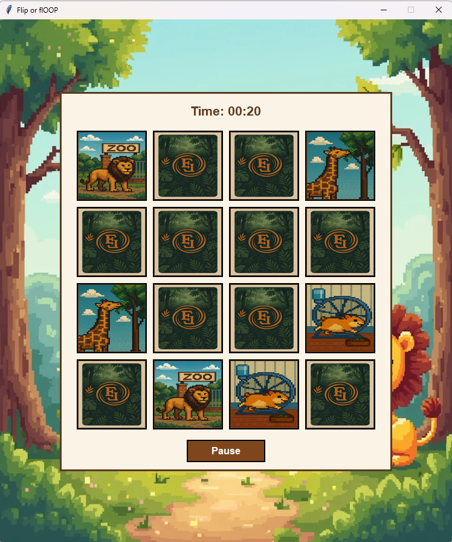
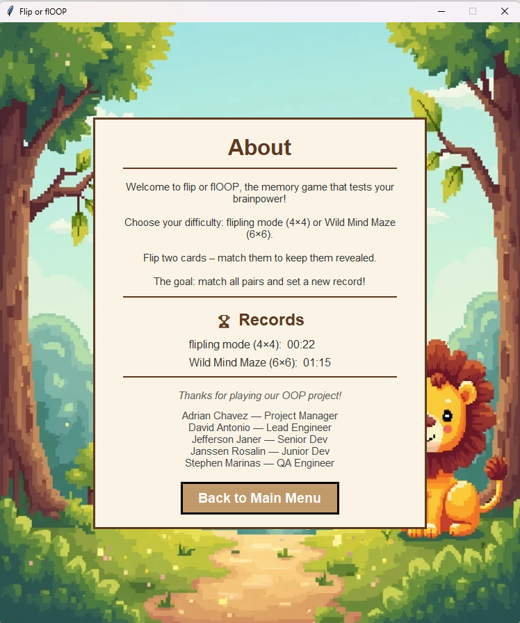

# 🦁 Flip or FlOOP — Animals Edition

A jungle-themed memory card-matching game built with **Python**, **Tkinter**, and **Pillow**.

Developed as a first-year OOP (Object-Oriented Programming) course project.


---

## 🎮 Features

- **Two difficulty modes**
  - 🐈 *Flipling Mode* — 4×4 grid (8 pairs) for beginners
  - 🦁 *Wild Mind Maze* — 6×6 grid (18 pairs) for a real challenge
- **Live timer** — tracks your completion time in `MM:SS` format
- **Pause / Resume** — freezes the timer and disables cards while paused
- **Persistent records** — your best times are saved to `records.json` across sessions
- **Background music** — looping jungle-themed audio with clean shutdown
- **Victory screen** — shows your time with options to replay or return to the menu
- **About screen** — game instructions, best-time records, and team credits

---

## 📸 Screenshots

| Home Screen | Gameplay (4×4) | About & Records |
|:-:|:-:|:-:|
|  |  |  |

---

## 🚀 Getting Started

### Prerequisites

- **Python 3.10+**
- **Pillow** (PIL fork)

### Installation

1. **Clone the repository**
   ```bash
   git clone https://github.com/adrian-aesi/flip-or-floop.git
   cd flip-or-floop
   ```

2. **Install dependencies**
   ```bash
   pip install Pillow
   ```

3. **Run the game**
   ```bash
   cd src
   python "Flip or FlOOP CODE.py"
   ```

> **Note:** Background music playback uses the Windows Multimedia API and is only available on Windows.

---

## 📁 Project Structure

```
flip-or-floop/
├── assets/                  # Images and audio
│   ├── background.png       # Pixel-art jungle background
│   ├── animals_edition.jpg  # "Animals Edition" title badge
│   ├── jungle_ahh.jpg       # Card back image
│   ├── music.mp3            # Background music
│   └── img1.png … img18.png # Card face images (animal illustrations)
├── screenshots/             # Screenshots for README
│   ├── home.png
│   ├── gameplay.png
│   └── about.png
├── src/                     # Python source code
│   ├── Flip or FlOOP CODE.py   # Main entry point & app controller
│   ├── game_screen.py          # Game logic, cards, timer, pause overlay
│   ├── about_screen.py         # About / credits / records screen
│   ├── victory_screen.py       # Victory screen
│   ├── music_player.py         # Background music player (Windows)
│   ├── record_manager.py       # Persistent best-time records (JSON)
│   └── utils.py                # Shared constants, logging, path helpers
├── records.json             # Saved best times (auto-generated)
└── README.md
```

---

## 🧱 Built With

| Technology | Purpose |
|---|---|
| **Python 3** | Core language |
| **Tkinter** | GUI framework (built into Python) |
| **Pillow** | Image loading and resizing |
| **JSON** | Persistent record storage |
| **Windows MCI** | Background music playback |

---

## 👥 Team

| Name | Role |
|---|---|
| Adrian Chavez | Project Manager |
| David Antonio | Lead Engineer |
| Jefferson Janer | Senior Developer |
| Janssen Rosalin | Junior Developer |
| Stephen Marinas | QA Engineer |

---

## 📄 License

This project is licensed under the [MIT License](LICENSE).
